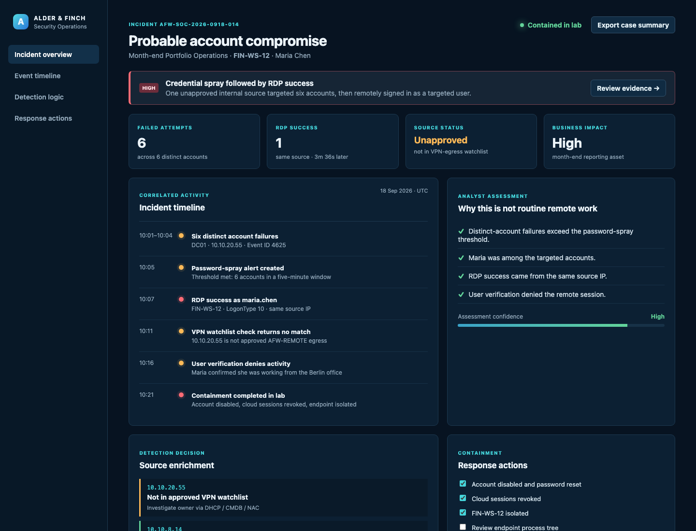

# SOC Case Study — Month-End RDP Account Compromise

**Organization:** Alder & Finch Wealth Management (fictional)  
**Environment:** Hybrid Windows estate, Microsoft Sentinel, Defender for Endpoint, Entra ID  
**Case owner:** SOC Analyst  
**Data:** Fully synthetic and safe to publish

This is a realistic Tier 1/2 SOC investigation set during a month-end reporting window. It is intentionally built around the uncomfortable details analysts work with: a high-value business deadline, a legitimate remote-access path that cannot simply be disabled, incomplete evidence at alert time, and a decision that must be documented clearly for incident response and IT operations.

## The working environment

Alder & Finch is a 420-person wealth-management firm headquartered in Berlin. Its Portfolio Operations team needs access to the `FIN-WS-*` virtual-desktop pool until 22:00 CET during the last three business days of every month to validate client valuation reports. Staff connect through the `AFW-REMOTE` VPN service, then use RDP to their assigned workstation. Direct internet RDP is prohibited.

`FIN-WS-12` belongs to Portfolio Operations analyst **Maria Chen**. It has access to the reconciliations share but is not a domain-admin workstation. The DC `DC01` records failed domain authentications, and Windows Security events from the virtual-desktop pool stream to Sentinel. The SOC maintains an approved-egress watchlist for the two corporate VPN ranges. It does **not** have a blanket suppression for month-end remote work.

At 10:01 UTC on 18 September, Sentinel creates an alert: one internal source (`10.10.20.55`) tried six employee accounts on `DC01` in under five minutes. At 10:07 UTC, the same source establishes an RDP session as Maria to `FIN-WS-12`. The source IP is within an internal range but is absent from the approved VPN-egress watchlist. This matters: it could be an unmonitored jump host, a misrouted session, or an attacker already inside the network.

## Analyst objective

Determine whether the alert is routine month-end access, a false positive caused by an internal system, or probable account compromise. Escalate with evidence—not assumptions—and preserve the business team's ability to complete time-sensitive work where it is safe to do so.

## Investigation outcome

The lab case is assessed as **probable account compromise (High)**. The distinct-account failure pattern is consistent with password spraying. The later successful RDP session uses one of the targeted accounts from the same non-approved source; Maria confirms that she was working from the Berlin office and did not initiate a remote session. `FIN-WS-12` is isolated, Maria's sessions are revoked, and the Portfolio Operations manager is provided with a replacement VDI plan.

## Working dashboard and evidence

This project includes a no-dependency, interactive local investigation dashboard. It renders the synthetic event data, source-enrichment result, analyst assessment, and containment checklist used in the case. It is intentionally labelled as a local lab dashboard, rather than a screenshot claimed to be from Microsoft Sentinel.

Open [`dashboard/index.html`](dashboard/index.html) in a browser to use it. The committed screenshot below was captured from that working local dashboard.

## Repository map

| Path | What a reviewer should look at |
| --- | --- |
| [`detections/password-spray.kql`](detections/password-spray.kql) | Scheduled Sentinel rule; counts distinct accounts, not noisy retries |
| [`detections/rdp-after-failure.kql`](detections/rdp-after-failure.kql) | Correlates a suspicious success to the earlier authentication failures |
| [`detections/source-not-on-approved-vpn.kql`](detections/source-not-on-approved-vpn.kql) | Enrichment query using a watchlist pattern |
| [`docs/analytic-rule-configuration.md`](docs/analytic-rule-configuration.md) | Deployable rule settings and tuning boundaries |
| [`docs/investigation.md`](docs/investigation.md) | Full case notes, timeline, assessment, and communications |
| [`docs/triage-playbook.md`](docs/triage-playbook.md) | Reusable analyst procedure |
| [`sample-data/auth-events.csv`](sample-data/auth-events.csv) | Synthetic event excerpt for walkthroughs |
| [`sample-data/approved-vpn-egress.csv`](sample-data/approved-vpn-egress.csv) | Example Sentinel watchlist data |
| [`dashboard/`](dashboard/) | Runnable, dependency-free local case dashboard |
| [`evidence/`](evidence/) | Screenshots captured from the local dashboard |

## Detection design decisions

- The spray rule requires five distinct accounts in five minutes. A single user retrying a bad password should not generate this alert.
- The RDP correlation looks for a remote-interactive logon within 30 minutes of a failure from the same source. It is an investigation accelerator, not an automated containment trigger.
- Approved VPN ranges belong in a Sentinel watchlist, where Network Engineering can maintain them. Avoid hard-coding network ranges in a rule.
- Month-end is a prioritization factor, not an exception. It makes the asset more business-critical and makes a careful containment plan more important.

## ATT&CK mapping

| Observed behavior | ATT&CK technique | Confidence |
| --- | --- | --- |
| Multiple accounts attempted from one source | [T1110.003 — Password Spraying](https://attack.mitre.org/techniques/T1110/003/) | High |
| Successful remote interactive login | [T1021.001 — Remote Services: RDP](https://attack.mitre.org/techniques/T1021/001/) | High |
| Use of Maria's account after failed attempts | [T1078 — Valid Accounts](https://attack.mitre.org/techniques/T1078/) | Medium pending endpoint review |

## How to adapt this to your own lab

1. Ingest Windows Security event IDs 4624 and 4625 into Sentinel's `SecurityEvent` table.
2. Create an `ApprovedVpnEgress` watchlist with the same column names as the sample CSV.
3. Import the scheduled query from the analytic-rule configuration, then test it only with authorized lab activity or historical events.
4. Replace the fictional company, asset names, and timelines with a clearly labelled account of your own test.

The files contain no credentials, executable content, live infrastructure, or real client data.
