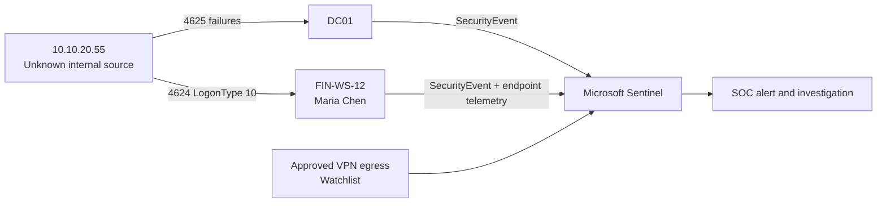

# Incident Record AFW-SOC-2026-0918-014

| Field | Value |
| --- | --- |
| Priority | High |
| Status | Contained in lab; endpoint review required before production closure |
| Business service | Month-end Portfolio Operations reconciliation |
| Affected user / asset | `maria.chen` / `FIN-WS-12` |
| Detection source | Microsoft Sentinel, Windows Security Events |
| Investigation window | 18 September 2026, 10:01–10:35 UTC |

## Executive summary

During a month-end reporting period, an internal address that is not registered as approved VPN egress attempted six distinct employee accounts against `DC01`. It then successfully established an RDP session to Maria Chen's portfolio workstation using one of the targeted accounts. Maria confirmed that she was in the Berlin office and did not start a remote session. The combined sequence is assessed as probable account compromise, not a routine month-end access pattern.

Containment balanced risk and operations: the SOC disabled Maria's account, revoked cloud sessions, and isolated `FIN-WS-12`; Portfolio Operations assigned a clean replacement VDI so the valuation deadline could continue. This is a fictional exercise. All names, infrastructure, IPs, and timestamps are synthetic.

## Environment and telemetry

| Asset | Owner / role | Why it matters |
| --- | --- | --- |
| `DC01` | Identity Services | Records domain authentication failures |
| `FIN-WS-12` | Maria Chen, Portfolio Operations | Access to month-end reconciliation data |
| `10.10.20.55` | Unknown at investigation start | Internal source absent from approved VPN list |
| `10.10.8.14` | `AFW-REMOTE Berlin` | Known-good comparison source in the sample |

## Timeline (UTC)

| Time | Event | Evidence | Analyst interpretation |
| --- | --- | --- | --- |
| 10:01–10:04 | Six user accounts fail authentication from `10.10.20.55` | 4625 on `DC01` | Pattern exceeds five-account spray threshold |
| 10:05 | Sentinel opens password-spray alert | `password-spray.kql` | Source requires context, not automatic blocking |
| 10:07 | `maria.chen` logs onto `FIN-WS-12` with RDP | 4624, LogonType 10 | Same source, targeted account, within correlation window |
| 10:11 | Approved-VPN watchlist check returns no match | `source-not-on-approved-vpn.kql` | Source is not an authorized remote egress IP |
| 10:16 | User contact confirms no remote session | Analyst case note | Raises confidence; preserve contact method and time |
| 10:21 | Account disabled; sessions revoked; endpoint isolated | Identity / endpoint response record | Containment completed |
| 10:28 | Operations manager receives replacement-VDI plan | Service desk record | Business continuity action |

## Evidence assessment

The alert is not closed as "password spray" on count alone. Confidence comes from the correlation:

1. The source attempted multiple distinct people, which is a more meaningful pattern than repeated failures against one account.
2. `maria.chen` was one of the targeted people and then had an RDP success from the same source.
3. The source is not a maintained VPN egress address.
4. The user denied the activity.

The evidence does not yet establish the initial access vector, malware presence, data access, or lateral movement. Endpoint telemetry, VPN/firewall flow logs, and Entra audit logs must be reviewed before declaring scope complete.

## Containment and next actions

| Action | Owner | State |
| --- | --- | --- |
| Disable account, reset password, revoke sessions | Identity Operations | Completed in lab |
| Isolate `FIN-WS-12`, preserve volatile evidence per policy | Endpoint Response | Completed in lab |
| Review process tree, persistence, and outbound connections from 10:07 UTC | Endpoint Response | Required |
| Identify owner of `10.10.20.55` using DHCP/CMDB/NAC records | Network Engineering | Required |
| Hunt IP and targeted account list across VPN, firewall, Entra, and endpoint data | SOC | Required |
| Provide replacement VDI and validate access | Portfolio Operations / IT | Completed in lab |

## Closure criteria

Close only when the source system has been identified and remediated, the endpoint review is complete, suspicious activity has been scoped across the environment, and the business owner accepts the restoration plan. If the source is confirmed unauthorized or endpoint review finds follow-on activity, promote to the incident-response process.
