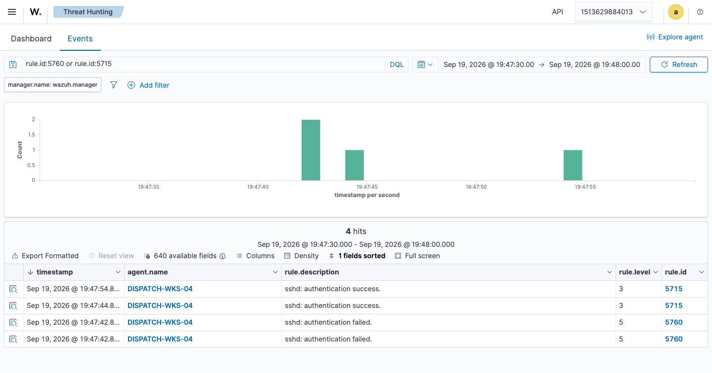
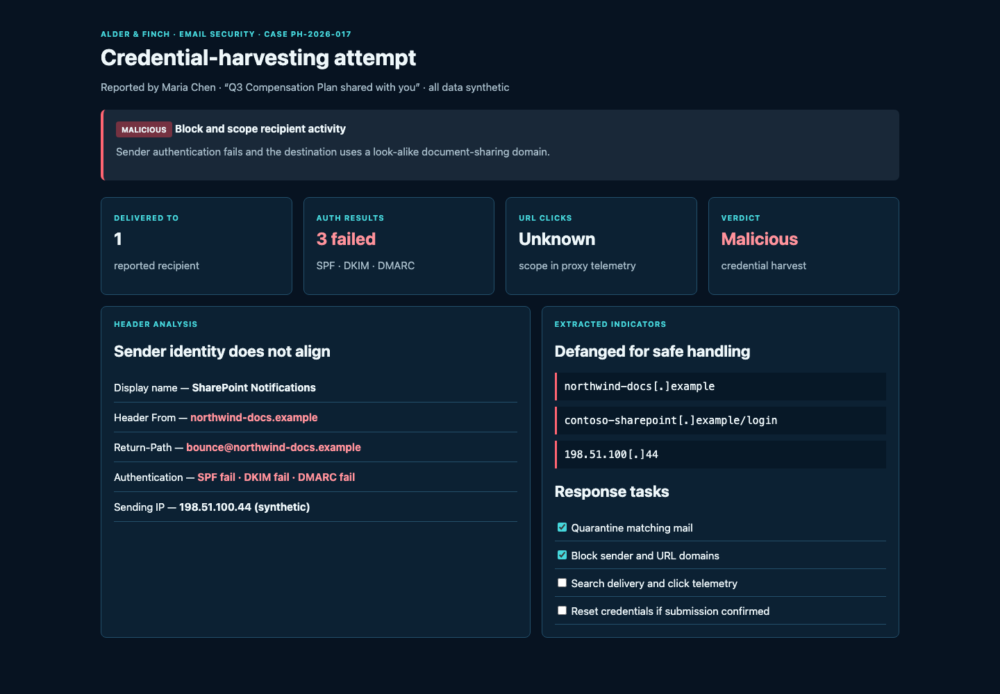
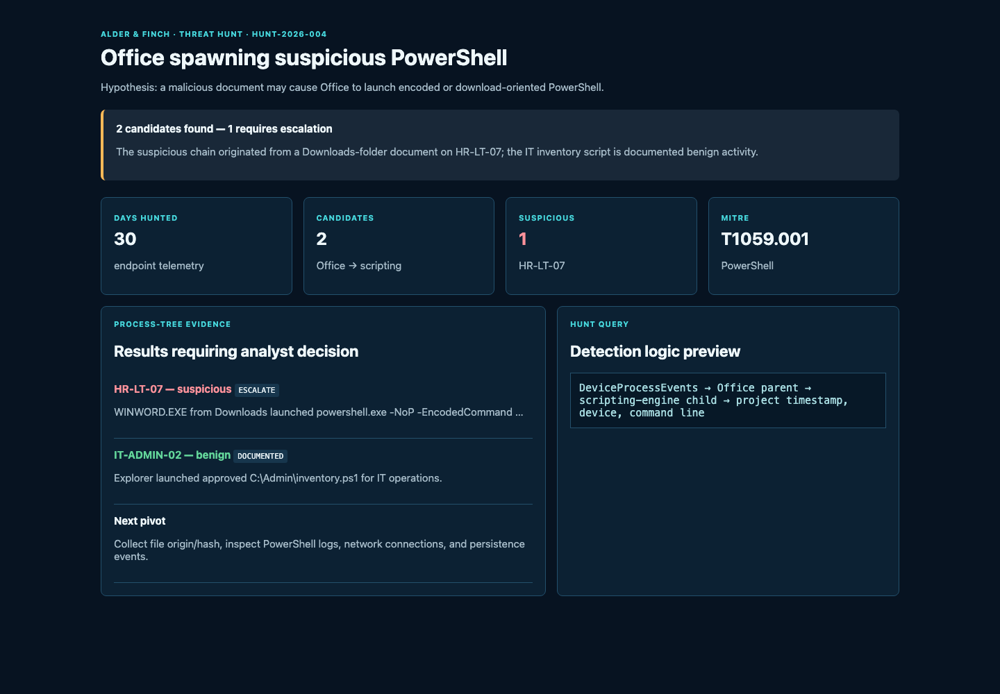
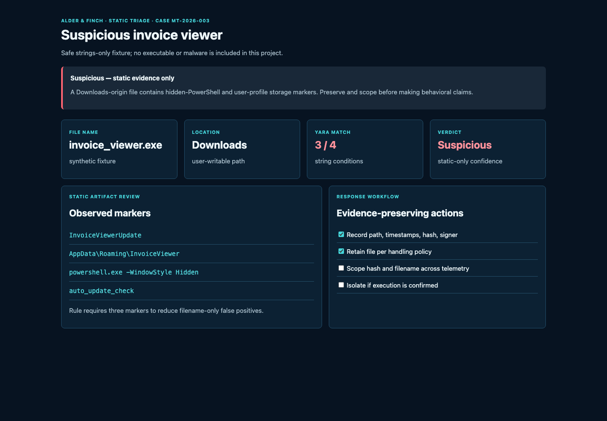
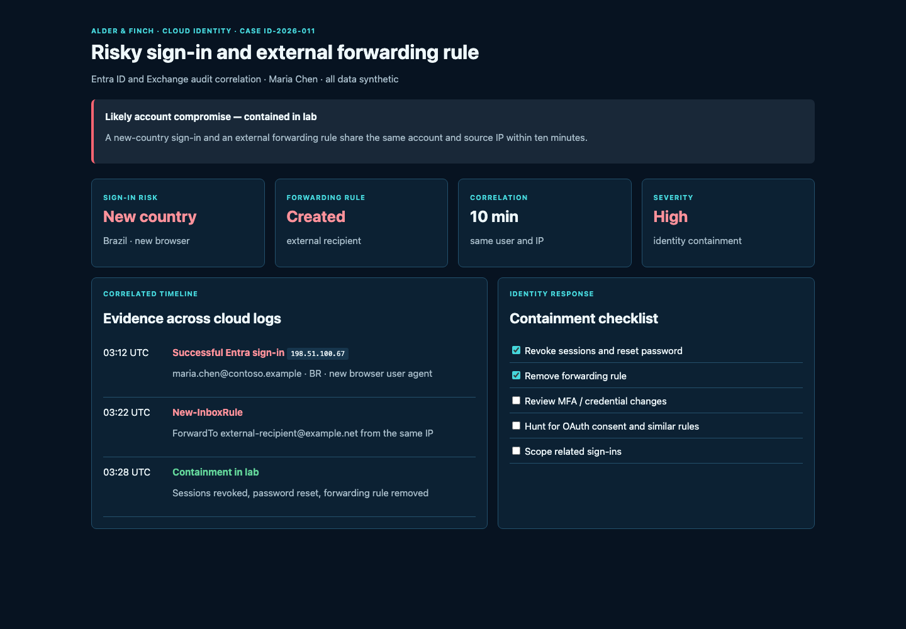

# SOC Analyst Portfolio

Six focused projects that demonstrate the day-to-day work of a Tier 1/2 SOC analyst: investigate alerts, write detections, hunt endpoint behavior, analyze phishing, triage suspicious files, and contain cloud-identity incidents. Every hostname, user, domain, IP address, and event is synthetic unless explicitly labelled as a local lab artifact.

## Portfolio projects

| Project | Scenario | Skills demonstrated |
| --- | --- | --- |
| [01 — Month-end RDP account compromise](01-windows-auth-detections/) | Wealth-management reporting period; password spray leads to suspicious RDP access | Sentinel KQL, Windows events, incident triage, business-aware containment |
| [02 — Phishing triage](02-phishing-triage/) | Look-alike document-sharing email targets an employee | Header analysis, email authentication, IOC handling, case writing |
| [03 — LOLBin threat hunt](03-lolbin-threat-hunt/) | Office process launches encoded PowerShell | Defender/Sysmon-style telemetry, KQL, MITRE mapping, false-positive analysis |
| [04 — Malware triage and YARA](04-malware-triage-yara/) | Suspicious downloaded "invoice viewer" file | Safe static triage, YARA, evidence scoping, response planning |
| [05 — Cloud identity investigation](05-cloud-identity-investigation/) | New-country sign-in is followed by external mail forwarding | Entra ID / Exchange logs, KQL, identity containment |
| [06 — Wazuh incident lab](06-wazuh-incident-lab/) | Reproducible Docker lab for SSH brute force and cron persistence | Wazuh, Docker, alert validation, ATT&CK, incident reporting |

## How to review this repository

Each project has its own README, detection content, synthetic artifacts or data, and a completed investigation/report. Start with Project 01 for the most detailed SOC workflow; Project 06 is the most hands-on runnable lab.

## Lab evidence gallery

The Project 01 screenshot below was captured from its working local case dashboard. The Wazuh screenshots are direct captures from the local Wazuh dashboard used in Project 06—not generated mock-ups.

### Project 01 — local SOC case dashboard

### Project 06 — Wazuh lab evidence

| SSH reconnaissance detection | Authentication investigation | Cron persistence evidence |
| --- | --- | --- |
|  |  |  |

### Projects 02–05 — local analyst consoles

| Phishing triage | LOLBin threat hunt |
| --- | --- |
|  |  |

| Malware triage | Cloud identity investigation |
| --- | --- |
|  |  |

## Safety and publishing notes

- No real credentials, malware, customer data, or live malicious infrastructure are included.
- Do not add exported production logs, PCAPs, `.env` files, private keys, or unredacted screenshots to this repository.
- The queries use Microsoft Sentinel table names where stated; adapt them to your own data connector and test them only in an authorized environment.
- Before using this in applications, add your name to the project README files and attach sanitized screenshots from your own lab where possible.
